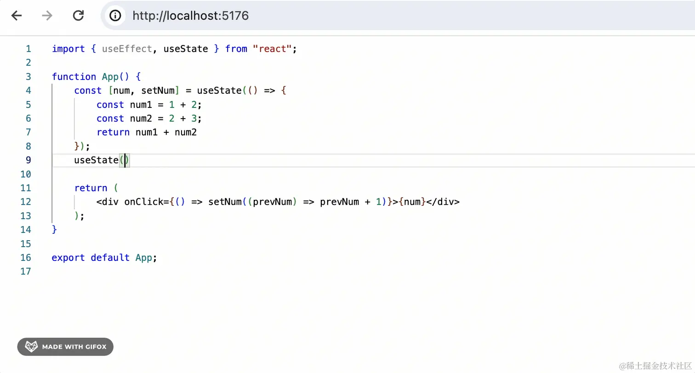

# 实用三方包

## NestJS 相关

### request-ip

- [request-ip](https://www.npmjs.com/package/request-ip)

从 HTTP 请求中检索客户端的 IP 地址。这对于记录用户访问日志、进行地理定位或安全控制等多种场景都非常有用 。这个模块特别适用于在代理和 CDN 后面运行的服务器，因为它能够正确地处理相关头部信息来找出真实的客户端 IP 地址

### class-validator

`class-validator` 是一个用于数据验证的 npm 包，它提供了一种基于装饰器和非装饰器的验证方式。这个库在内部使用 `validator.js` 来执行验证，并且可以在浏览器和 Node.js 平台上运行。它非常适合与 TypeScript 结合使用，可以在编译时提供类型安全保障，并减少运行时错误的可能性。

#### 使用示例

使用 `class-validator` 时，你可以在你的类上添加装饰器来定义想要验证的属性。例如：

```typescript
import { IsEmail, IsNotEmpty, MinLength, MaxLength } from "class-validator";

export class User {
  @IsEmail()
  email: string;

  @IsNotEmpty()
  @MinLength(3)
  @MaxLength(20)
  name: string;
}
```

然后，你可以使用 `validate` 或 `validateOrReject` 方法来执行实际的验证：

```typescript
import { validate } from "class-validator";

const user = new User();
user.email = "example@mail.com";
user.name = "John";

validate(user).then((errors) => {
  if (errors.length > 0) {
    console.log("Validation failed", errors);
  } else {
    console.log("Validation succeeded");
  }
});
```

#### 自定义验证

`class-validator` 也支持自定义验证逻辑。你可以创建自定义的验证类或装饰器来满足特定的验证需求。例如，创建一个自定义验证装饰器 `@IsLongerThan`：

```typescript
import { registerDecorator } from "class-validator";

export function IsLongerThan(property: string) {
  return function (object: Object, propertyName: string) {
    registerDecorator({
      name: "isLongerThan",
      target: object.constructor,
      propertyName: propertyName,
      constraints: [property],
      validator: {
        validate(value: string, args: any) {
          const relatedProperty = (args.object as any)[args.constraints[0]];
          return value.length > relatedProperty.length;
        },
      },
    });
  };
}
```

### class-transformer

`class-transformer` 是一个 npm 包，它提供了一种将普通 JavaScript 对象（通常从 JSON 解析得到）转换为类实例的方法，并且可以用来转换类的属性。这个库通常与 `class-validator` 一起使用，后者是一个流行的用于验证 JavaScript 对象和类实例的库。

1. **转换普通对象到类实例**：`class-transformer` 允许你将普通 JavaScript 对象（plain object）转换为类的实例，这在使用装饰器进行验证之前非常有用。

2. **属性转换**：它还提供了转换属性的功能，例如将字符串日期转换为 `Date` 对象。

3. **嵌套对象转换**：能够处理嵌套对象和数组，将它们转换为相应的类实例。

4. **自定义转换器**：支持定义自定义转换器，以处理特殊的转换逻辑。

#### 使用示例

```typescript
import { plainToClass, ClassTransformer } from "class-transformer";
import { IsString, IsInt } from "class-validator";

class User {
  @IsString()
  firstName: string;

  @IsString()
  lastName: string;

  @IsInt()
  age: number;
}

const userObject = {
  firstName: "John",
  lastName: "Doe",
  age: "30", // 将被转换为数字类型
};

const user = plainToClass(User, userObject);
console.log(user instanceof User); // true
console.log(user.age); // 30
```

## @monaco-editor/react

- [monaco-editor/react](https://www.npmjs.com/package/@monaco-editor/react)

一个封装了 Monaco Editor 的 React 组件库,由 Visual Studio Code 团队开发的代码编辑器，它提供了丰富的代码编辑功能，包括语法高亮、智能感知、代码自动补全等。

```jsx
import Editor from "@monaco-editor/react";

function App() {
  const code = `import { useEffect, useState } from "react";

function App() {
    const [num, setNum] = useState(() => {
        const num1 = 1 + 2;
        const num2 = 2 + 3;
        return num1 + num2
    });

    return (
        <div onClick={() => setNum((prevNum) => prevNum + 1)}>{num}</div>
    );
}

export default App;
`;

  return (
    <Editor height="500px" defaultLanguage="javascript" defaultValue={code} />
  );
}

export default App;
```



## allotment

[allotment](https://github.com/johnwalley/allotment) 是一个基于 React 的开源组件库，它提供了一种简单的方式来实现可分割的视图面板，类似于 VS Code 的分屏视图功能。这种组件特别适用于需要在 Web 应用程序中展示多个相关内容的场景，比如代码编辑器中的文件和目录树同时展示，或者数据可视化工具中图表与相关数据的并排展示。

### 使用 `allotment`示例：

1. **安装**：首先，你需要安装 `allotment` 包以及它的依赖 `react` 和 `react-dom`。使用 npm 或 yarn 来安装它们：

   ```sh
   npm install react react-dom allotment
   ```

   或者

   ```sh
   yarn add react react-dom allotment
   ```

2. **引入样式**：在你的 React 应用中，需要引入 `allotment` 的样式文件：

   ```jsx
   import "allotment/dist/style.css";
   ```

3. **使用组件**：在组件中使用 `Allotment` 和 `Allotment.Pane` 来创建分割视图。例如：

   ```jsx
   import React from "react";
   import { Allotment, AllotmentPane } from "allotment";

   const App = () => (
     <Allotment>
       <Allotment.Pane minSize={200}>
         <div>左侧面板内容</div>
       </Allotment.Pane>
       <Allotment.Pane>
         <div>右侧面板内容</div>
       </Allotment.Pane>
     </Allotment>
   );
   ```

4. **配置属性**：`Allotment` 组件和 `Allotment.Pane` 组件提供了多种属性来自定义行为，例如 `minSize` 可以设置面板的最小尺寸，`defaultSizes` 可以设置初始面板大小等。

5. **获取组件实例**：如果需要程序化控制，可以通过 ref 获取到 `Allotment` 组件实例，并调用其方法，例如 `reset` 和 `resize`。


## react-dnd

[React-DnD](https://react-dnd.github.io/react-dnd/docs/tutorial) 是一个用于构建复杂拖拽界面的 React 库，它非常适合需要在不同组件之间拖拽传输数据的应用，如 Trello 或 Storify 等。React-DnD 的核心特性包括使用包裹和注入的方式使组件实现拖拽，同时保持组件分离，以及适用于构建复杂的拖放界面 。

### 使用示例

以下是一个简单的 React-DnD 示例，展示如何实现一个可拖拽的组件和一个可放置的组件：

1. **安装 React-DnD 和 HTML5 后端：**

```sh
npm install react-dnd react-dnd-html5-backend
```

2. **定义拖拽类型：**

```javascript
// ItemTypes.js
export default {
  MY_DRAGGABLE: "my-draggable",
  MY_DROPPABLE: "my-droppable",
};
```

3. **创建可拖拽组件（DragSource）：**

```javascript
import React from "react";
import { useDrag } from "react-dnd";

const draggableStyle = {
  border: "1px solid gray",
  padding: "10px",
  width: "100px",
  height: "100px",
  textAlign: "center",
};

const MyDraggableComponent = ({ id }) => {
  const [{ isDragging }, drag] = useDrag(() => ({
    type: "my-draggable",
    item: { id },
    collect: (monitor) => ({
      isDragging: monitor.isDragging(),
    }),
  }));

  const opacity = isDragging ? 0.5 : 1;
  return (
    <div ref={drag} style={{ ...draggableStyle, opacity }}>
      Drag me {id}
    </div>
  );
};

export default MyDraggableComponent;
```

4. **创建可放置组件（DropTarget）：**

```javascript
import React, { useRef, useState } from "react";
import { useDrop } from "react-dnd";

const droppableStyle = {
  border: "1px solid gray",
  padding: "10px",
  width: "200px",
  height: "200px",
  textAlign: "center",
  color: "white",
  background: "green",
};

const MyDroppableComponent = () => {
  const [collectedId, setCollectedId] = useState(null);
  const ref = useRef(null);

  const [{ isOver, canDrop }, drop] = useDrop(() => ({
    accept: "my-draggable",
    drop: (item) => {
      setCollectedId(item.id);
    },
    collect: (monitor) => ({
      isOver: monitor.isOver(),
      canDrop: monitor.canDrop(),
    }),
  }));

  const isActive = canDrop && isOver;
  return (
    <div
      ref={drop}
      style={{ ...droppableStyle, background: isActive ? "red" : "green" }}
    >
      {collectedId || "Drop here"}
    </div>
  );
};

export default MyDroppableComponent;
```

5. **在应用中使用这些组件：**

```javascript
import React from "react";
import { DndProvider } from "react-dnd";
import HTML5Backend from "react-dnd-html5-backend";
import MyDraggableComponent from "./MyDraggableComponent";
import MyDroppableComponent from "./MyDroppableComponent";

const App = () => (
  <DndProvider backend={HTML5Backend}>
    <div style={{ display: "flex", justifyContent: "space-around" }}>
      <MyDraggableComponent id="1" />
      <MyDraggableComponent id="2" />
      <MyDroppableComponent />
    </div>
  </DndProvider>
);

export default App;
```

在这个示例中，`MyDraggableComponent` 可以被拖拽，而 `MyDroppableComponent` 可以接受被拖拽的元素。`DragSource` 和 `DropTarget` 都是高阶组件，它们通过装饰器模式增强了组件的拖拽功能。`DragDropContext` 包裹了整个拖拽上下文，并使用 `HTML5Backend` 作为后端实现 。

React-DnD 提供了更多的配置选项和高级特性，如监控器（Monitors）、连接器（Connectors）以及更复杂的拖拽行为定义，来满足复杂的拖拽需求 。

### onMoussOver --- composedPath

onMouseOver 事件中的 composedPath() 方法是 Event 接口的一个成员，它的作用是返回当事件被触发时，从事件触发的最内层节点一直到事件捕获的最外层节点的完整事件处理路径，即事件在 DOM 中的传播路径。

composedPath() 方法返回的是一个 EventTarget 对象数组，这个数组包含了事件传播路径上的所有节点。如果影子 DOM 的模式是关闭的 ('closed')，则这个路径不会包括影子树中的节点。

，在 React-DnD 的上下文中，composedPath() 可以用于确定拖拽事件的当前目标，这有助于开发者处理拖拽过程中的交互，例如自定义拖拽元素的样式或行为。
